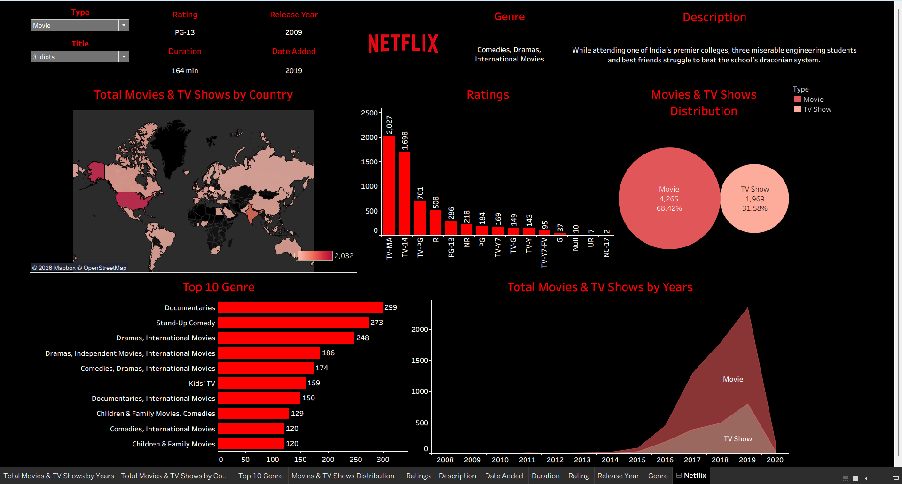

# 🎬 Netflix Content Analysis Dashboard (Tableau)

## 🛠 Tools & Technologies Used

- Tableau Public
- Data Cleaning & Preparation
- Data Visualization Techniques
- Interactive Dashboard Design

---

## 🎥 Dashboard Demo (Video)

Click below to watch a short 20-second walkthrough of the dashboard:

[▶ Watch Dashboard Demo](demo.mp4)

---

## 📸 Dashboard Preview (Image)

Below is a preview image of the dashboard:

---

## 📂 Project Structure

Netflix-Content-Analysis-Tableau/
│
├── Netflix Dashboard.twbx  
├── netflix_titles.csv  
├── demo.mp4  
├── output.png  
└── README.md  

---

## 💼 Resume Description (Short Version)

Built an interactive Tableau dashboard to analyze Netflix content trends, genre distribution, and country-wise insights using real-world dataset.

---

## 🚀 Future Improvements

- Add advanced calculated fields  
- Implement parameter-based dynamic charts  
- Add rating distribution analysis  
- Deploy to Tableau Public profile with portfolio link  

---

## 👨‍💻 Author

Sanskar Gupta  
B.Tech CSE (Data Science)

---

⭐ If you found this project useful, feel free to star the repository!

